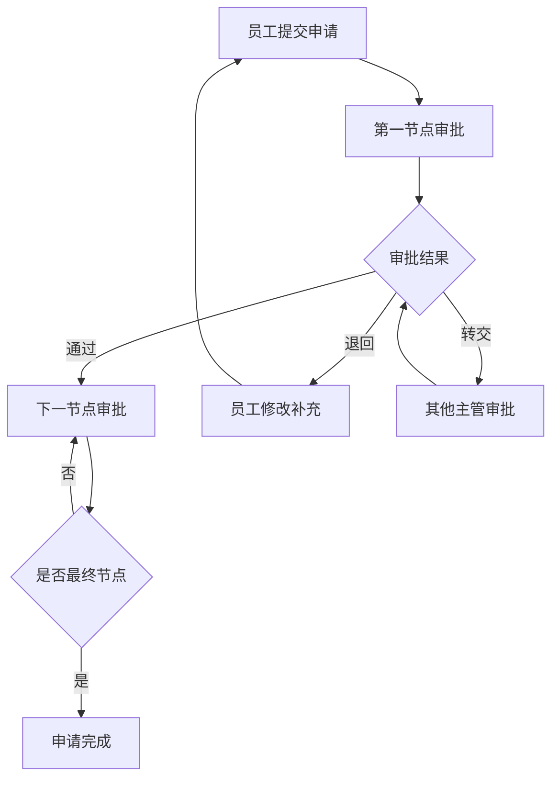

## 1. 产品概述

企业内部工作流审批系统，用于管理申请、审批节点、时限规则和处理意见。系统支持可配置的工作流引擎，不同申请类型可绑定不同审批流程，实现高效的企业内部审批管理。

- **核心目标**：提供灵活可配置的审批流程，满足企业多样化的审批需求
- **目标用户**：企业管理员、普通员工、部门主管
- **核心价值**：简化审批流程，提高办公效率，实现审批流程数字化管理

## 2. 核心功能

### 2.1 用户角色

| 角色 | 登录方式 | 核心权限 |
|------|----------|----------|
| 管理员 | 账号密码登录 | 配置流程模板、管理角色范围、查看所有审批数据 |
| 员工 | 账号密码登录 | 提交申请、补充材料、查看申请进度和历史 |
| 主管 | 账号密码登录 | 审批申请、退回申请、转交审批、填写处理意见 |

### 2.2 功能模块

1. **登录页面**：角色选择、账号密码登录
2. **管理员仪表盘**：流程模板管理、角色权限配置、系统统计
3. **员工工作台**：申请列表、新建申请、我的申请、补充材料
4. **主管审批台**：待办审批、已办审批、审批操作（通过/退回/转交）
5. **流程图编辑器**：可视化流程配置、节点拖拽、右键菜单操作

### 2.3 页面详情

| 页面名称 | 模块名称 | 功能描述 |
|----------|----------|----------|
| 登录页 | 登录表单 | 角色选择、账号输入、密码输入、登录验证 |
| 管理员-流程模板 | 模板列表 | 查看所有流程模板、创建新模板、编辑模板、删除模板 |
| 管理员-流程编辑 | 流程图设计 | 拖拽添加节点、配置节点属性、连线、设置超时规则 |
| 管理员-角色管理 | 角色配置 | 配置角色范围、分配审批权限、管理用户 |
| 员工-申请列表 | 我的申请 | 查看所有申请状态、筛选、搜索 |
| 员工-新建申请 | 申请提交 | 选择申请类型、填写表单、上传附件、提交申请 |
| 员工-申请详情 | 申请详情 | 查看审批进度、补充材料、查看处理意见 |
| 主管-待办审批 | 待办列表 | 查看待审批申请、一键处理 |
| 主管-审批详情 | 审批操作 | 查看申请详情、填写意见、通过、退回、转交 |

## 3. 核心流程

### 3.1 管理员配置流程

管理员登录 → 创建流程模板 → 配置审批节点（拖拽节点、设置处理人、设置超时规则）→ 绑定角色范围 → 启用流程

### 3.2 员工申请流程

员工登录 → 选择申请类型 → 填写申请表单 → 上传附件 → 提交申请 → 等待审批 → 查看进度 → 如需补充材料 → 补充后重新提交

### 3.3 主管审批流程

主管登录 → 查看待办列表 → 选择申请 → 查看详情 → 填写处理意见 → 通过/退回/转交 → 流程流转到下一节点

## 4. 用户界面设计

### 4.1 设计风格

- **主色调**：深蓝色 (#1e40af) 代表专业和信任
- **辅助色**：青色 (#0891b2) 用于强调和交互元素
- **中性色**：锌灰色系 (#18181b, #52525b, #d4d4d8, #fafafa)
- **按钮风格**：圆角 8px，悬停有阴影和颜色变化
- **字体**：Inter（无衬线），标题 600 字重，正文 400 字重
- **布局风格**：卡片式布局，侧边导航 + 顶部栏 + 内容区
- **图标风格**：Lucide React 线性图标

### 4.2 页面设计概述

| 页面名称 | 模块名称 | UI 元素 |
|----------|----------|---------|
| 登录页 | 登录卡片 | 渐变背景、居中卡片、角色切换标签、表单输入框、登录按钮 |
| 仪表盘 | 侧边导航 | 折叠式侧边栏、图标菜单、角色标识、当前用户信息 |
| 流程图编辑器 | 画布区域 | 节点拖拽、连线、网格背景、右键自定义菜单、属性面板 |
| 申请列表 | 数据表格 | 分页、筛选、搜索、状态标签、操作按钮 |
| 审批详情 | 详情面板 | 时间线、附件列表、意见输入框、操作按钮组 |

### 4.3 响应式设计

- 桌面优先设计，最小支持宽度 1280px
- 侧边栏在小屏幕可折叠
- 表格支持横向滚动
- 右键菜单适配不同屏幕位置

### 4.4 右键自定义菜单

在流程图列表和画布中，用户右键点击节点可触发菜单：
- 复制节点：快速复制当前节点配置
- 设为必填：标记该节点为必填审批节点
- 暂停节点：暂停该节点的审批流转
- 查看历史：查看该节点的审批历史记录
