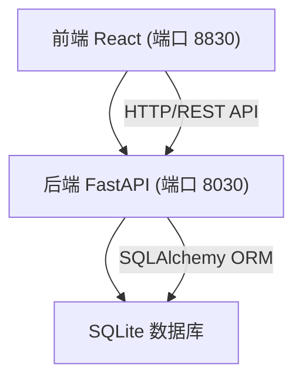
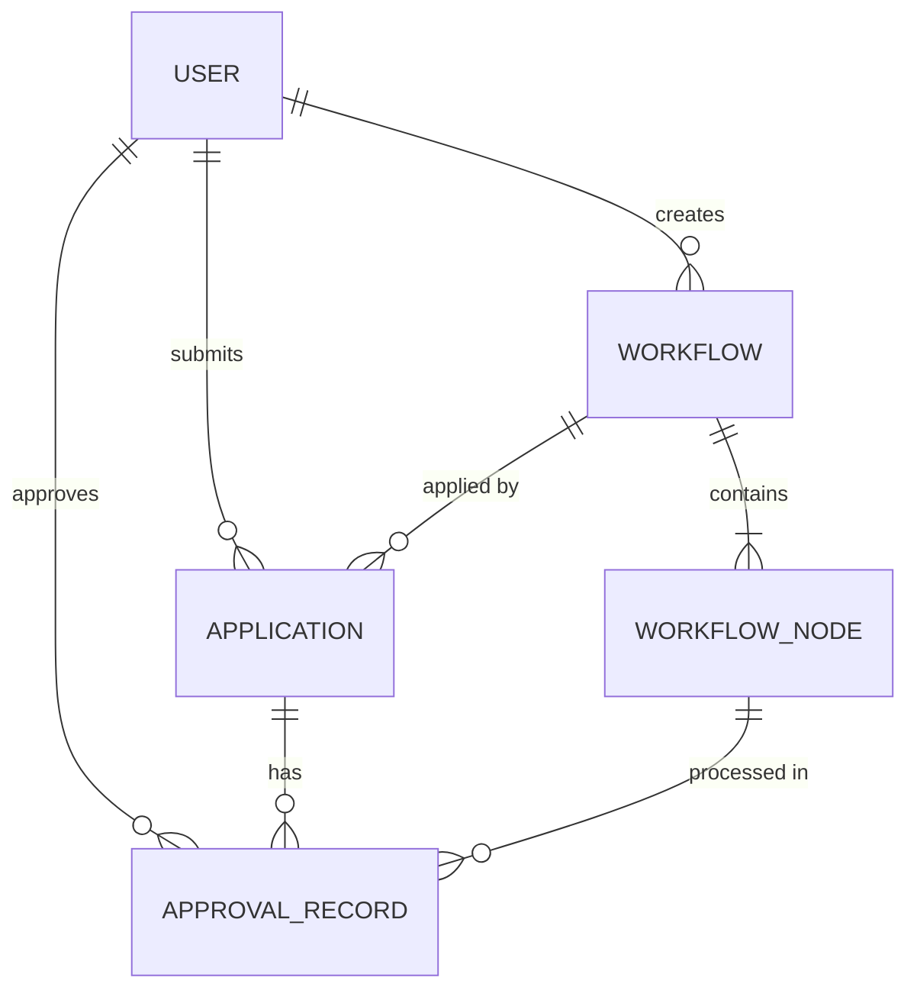

## 1. 架构设计



## 2. 技术描述

### 2.1 前端技术栈
- **框架**: React 18 + TypeScript
- **构建工具**: Vite
- **样式方案**: TailwindCSS 3
- **状态管理**: Zustand
- **路由**: React Router DOM 6
- **图标库**: Lucide React
- **UI 组件**: 自定义组件 + Radix UI (右键菜单)

### 2.2 后端技术栈
- **框架**: FastAPI (Python)
- **ORM**: SQLAlchemy 2.0
- **数据库**: SQLite
- **认证**: JWT (PyJWT)
- **数据验证**: Pydantic

### 2.3 项目结构
```
project-root/
├── frontend/                 # 前端项目
│   ├── src/
│   │   ├── components/       # 公共组件
│   │   ├── pages/           # 页面组件
│   │   ├── hooks/           # 自定义 Hooks
│   │   ├── store/           # Zustand 状态管理
│   │   ├── services/        # API 请求封装
│   │   ├── utils/           # 工具函数
│   │   └── types/           # TypeScript 类型定义
│   ├── package.json
│   └── vite.config.ts       # 配置端口 8830
│
├── backend/                  # 后端项目
│   ├── app/
│   │   ├── __init__.py
│   │   ├── main.py          # FastAPI 入口 (端口 8030)
│   │   ├── models/          # SQLAlchemy 模型
│   │   ├── schemas/         # Pydantic 模式
│   │   ├── routes/          # API 路由
│   │   ├── services/        # 业务逻辑
│   │   ├── database.py      # 数据库连接
│   │   └── auth.py          # 认证相关
│   ├── requirements.txt
│   └── workflow.db          # SQLite 数据库文件
│
└── .trae/documents/         # 项目文档
```

## 3. 路由定义

### 3.1 前端路由
| 路由 | 页面 | 权限 |
|------|------|------|
| /login | 登录页面 | 公开 |
| /admin/dashboard | 管理员仪表盘 | 管理员 |
| /admin/workflows | 流程模板列表 | 管理员 |
| /admin/workflows/:id | 流程编辑器 | 管理员 |
| /admin/roles | 角色管理 | 管理员 |
| /employee/dashboard | 员工工作台 | 员工 |
| /employee/applications | 我的申请 | 员工 |
| /employee/applications/new | 新建申请 | 员工 |
| /employee/applications/:id | 申请详情 | 员工 |
| /supervisor/dashboard | 主管审批台 | 主管 |
| /supervisor/pending | 待办审批 | 主管 |
| /supervisor/approved | 已办审批 | 主管 |
| /supervisor/applications/:id | 审批详情 | 主管 |

### 3.2 后端 API 路由
| 方法 | 路径 | 描述 |
|------|------|------|
| POST | /api/auth/login | 用户登录 |
| GET | /api/auth/me | 获取当前用户信息 |
| GET | /api/users | 获取用户列表 |
| POST | /api/users | 创建用户 |
| PUT | /api/users/:id | 更新用户 |
| DELETE | /api/users/:id | 删除用户 |
| GET | /api/workflows | 获取流程模板列表 |
| POST | /api/workflows | 创建流程模板 |
| GET | /api/workflows/:id | 获取流程详情 |
| PUT | /api/workflows/:id | 更新流程模板 |
| DELETE | /api/workflows/:id | 删除流程模板 |
| POST | /api/workflows/:id/nodes | 添加流程节点 |
| PUT | /api/nodes/:id | 更新节点 |
| DELETE | /api/nodes/:id | 删除节点 |
| POST | /api/nodes/:id/copy | 复制节点 |
| POST | /api/nodes/:id/required | 设为必填 |
| POST | /api/nodes/:id/pause | 暂停节点 |
| GET | /api/nodes/:id/history | 查看节点历史 |
| GET | /api/applications | 获取申请列表 |
| POST | /api/applications | 创建申请 |
| GET | /api/applications/:id | 获取申请详情 |
| PUT | /api/applications/:id | 更新申请 |
| POST | /api/applications/:id/submit | 提交申请 |
| POST | /api/approvals/:id/approve | 通过审批 |
| POST | /api/approvals/:id/reject | 退回申请 |
| POST | /api/approvals/:id/transfer | 转交审批 |
| POST | /api/approvals/:id/comment | 添加处理意见 |

## 4. API 类型定义

```typescript
// 用户类型
interface User {
  id: number;
  username: string;
  name: string;
  role: 'admin' | 'employee' | 'supervisor';
  department: string;
  createdAt: string;
}

// 流程节点
interface WorkflowNode {
  id: number;
  workflowId: number;
  name: string;
  type: 'start' | 'approval' | 'condition' | 'end';
  assigneeRole?: string;
  assigneeUserId?: number;
  timeoutHours?: number;
  isRequired: boolean;
  isPaused: boolean;
  positionX: number;
  positionY: number;
  nextNodeIds: number[];
}

// 流程模板
interface Workflow {
  id: number;
  name: string;
  description: string;
  type: string;
  nodes: WorkflowNode[];
  isActive: boolean;
  createdBy: number;
  createdAt: string;
}

// 申请
interface Application {
  id: number;
  workflowId: number;
  title: string;
  content: string;
  applicantId: number;
  status: 'draft' | 'pending' | 'approved' | 'rejected' | 'completed';
  currentNodeId?: number;
  attachments: string[];
  createdAt: string;
  updatedAt: string;
}

// 审批记录
interface ApprovalRecord {
  id: number;
  applicationId: number;
  nodeId: number;
  approverId: number;
  action: 'approve' | 'reject' | 'transfer';
  comment: string;
  createdAt: string;
}
```

## 5. 服务器架构图


## 6. 数据模型

### 6.1 ER 图



### 6.2 数据库表结构

```sql
-- 用户表
CREATE TABLE users (
    id INTEGER PRIMARY KEY AUTOINCREMENT,
    username VARCHAR(50) UNIQUE NOT NULL,
    password_hash VARCHAR(255) NOT NULL,
    name VARCHAR(100) NOT NULL,
    role VARCHAR(20) NOT NULL CHECK (role IN ('admin', 'employee', 'supervisor')),
    department VARCHAR(100),
    created_at TIMESTAMP DEFAULT CURRENT_TIMESTAMP
);

-- 流程模板表
CREATE TABLE workflows (
    id INTEGER PRIMARY KEY AUTOINCREMENT,
    name VARCHAR(100) NOT NULL,
    description TEXT,
    type VARCHAR(50) NOT NULL,
    is_active BOOLEAN DEFAULT 1,
    created_by INTEGER NOT NULL,
    created_at TIMESTAMP DEFAULT CURRENT_TIMESTAMP,
    FOREIGN KEY (created_by) REFERENCES users(id)
);

-- 流程节点表
CREATE TABLE workflow_nodes (
    id INTEGER PRIMARY KEY AUTOINCREMENT,
    workflow_id INTEGER NOT NULL,
    name VARCHAR(100) NOT NULL,
    type VARCHAR(20) NOT NULL CHECK (type IN ('start', 'approval', 'condition', 'end')),
    assignee_role VARCHAR(20),
    assignee_user_id INTEGER,
    timeout_hours INTEGER,
    is_required BOOLEAN DEFAULT 1,
    is_paused BOOLEAN DEFAULT 0,
    position_x INTEGER DEFAULT 0,
    position_y INTEGER DEFAULT 0,
    FOREIGN KEY (workflow_id) REFERENCES workflows(id) ON DELETE CASCADE,
    FOREIGN KEY (assignee_user_id) REFERENCES users(id)
);

-- 节点连线表
CREATE TABLE node_connections (
    id INTEGER PRIMARY KEY AUTOINCREMENT,
    from_node_id INTEGER NOT NULL,
    to_node_id INTEGER NOT NULL,
    FOREIGN KEY (from_node_id) REFERENCES workflow_nodes(id) ON DELETE CASCADE,
    FOREIGN KEY (to_node_id) REFERENCES workflow_nodes(id) ON DELETE CASCADE
);

-- 申请表
CREATE TABLE applications (
    id INTEGER PRIMARY KEY AUTOINCREMENT,
    workflow_id INTEGER NOT NULL,
    title VARCHAR(200) NOT NULL,
    content TEXT,
    applicant_id INTEGER NOT NULL,
    status VARCHAR(20) NOT NULL DEFAULT 'draft' CHECK (status IN ('draft', 'pending', 'approved', 'rejected', 'completed')),
    current_node_id INTEGER,
    attachments TEXT,
    created_at TIMESTAMP DEFAULT CURRENT_TIMESTAMP,
    updated_at TIMESTAMP DEFAULT CURRENT_TIMESTAMP,
    FOREIGN KEY (workflow_id) REFERENCES workflows(id),
    FOREIGN KEY (applicant_id) REFERENCES users(id),
    FOREIGN KEY (current_node_id) REFERENCES workflow_nodes(id)
);

-- 审批记录表
CREATE TABLE approval_records (
    id INTEGER PRIMARY KEY AUTOINCREMENT,
    application_id INTEGER NOT NULL,
    node_id INTEGER NOT NULL,
    approver_id INTEGER NOT NULL,
    action VARCHAR(20) NOT NULL CHECK (action IN ('approve', 'reject', 'transfer')),
    comment TEXT,
    transfer_to_user_id INTEGER,
    created_at TIMESTAMP DEFAULT CURRENT_TIMESTAMP,
    FOREIGN KEY (application_id) REFERENCES applications(id) ON DELETE CASCADE,
    FOREIGN KEY (node_id) REFERENCES workflow_nodes(id),
    FOREIGN KEY (approver_id) REFERENCES users(id),
    FOREIGN KEY (transfer_to_user_id) REFERENCES users(id)
);

-- 节点操作历史表
CREATE TABLE node_history (
    id INTEGER PRIMARY KEY AUTOINCREMENT,
    node_id INTEGER NOT NULL,
    action VARCHAR(50) NOT NULL,
    operator_id INTEGER NOT NULL,
    details TEXT,
    created_at TIMESTAMP DEFAULT CURRENT_TIMESTAMP,
    FOREIGN KEY (node_id) REFERENCES workflow_nodes(id) ON DELETE CASCADE,
    FOREIGN KEY (operator_id) REFERENCES users(id)
);

-- 初始数据
INSERT INTO users (username, password_hash, name, role, department) VALUES
('admin', 'admin123', '系统管理员', 'admin', 'IT部'),
('employee1', '123456', '张三', 'employee', '市场部'),
('employee2', '123456', '李四', 'employee', '技术部'),
('supervisor1', '123456', '王主管', 'supervisor', '市场部'),
('supervisor2', '123456', '李主管', 'supervisor', '技术部');
```
